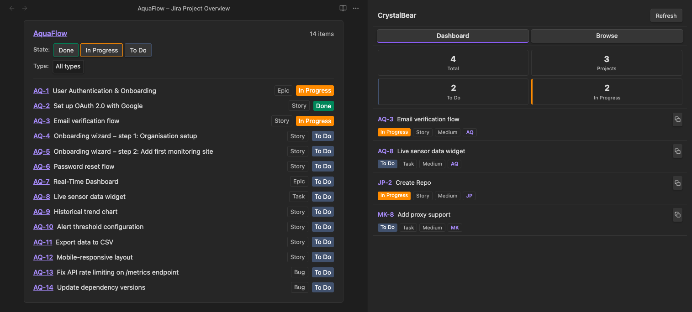
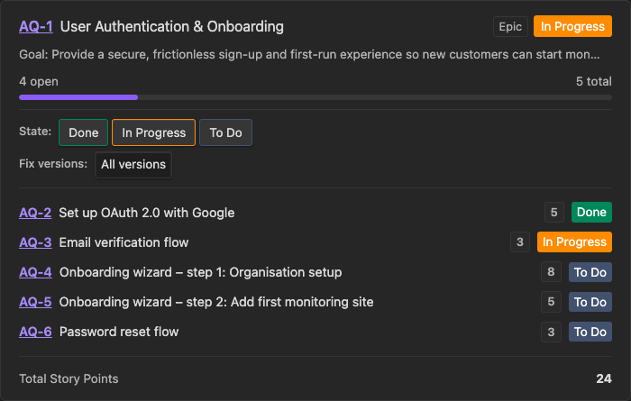
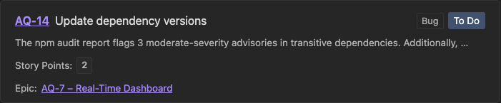
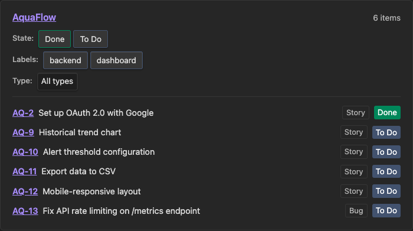
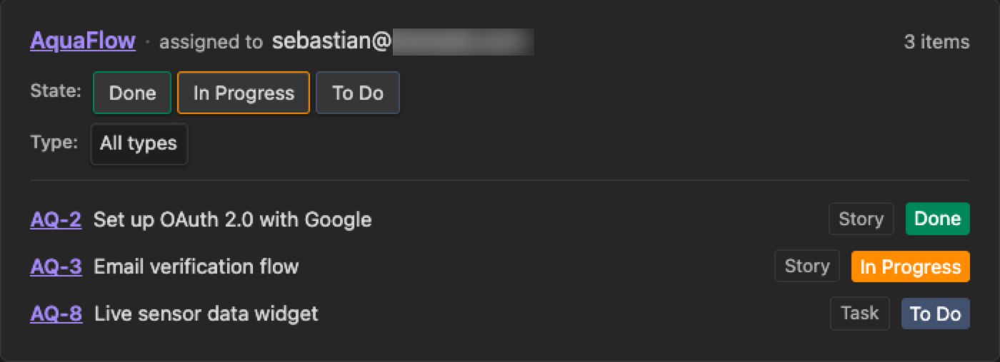

# CrystalBear

CrystalBear is an [Obsidian](https://obsidian.md) plugin that brings Jira directly into your notes. It renders issues, epics, and project views as rich inline blocks inside fenced code blocks, and provides a side panel for browsing and pinning your Jira issues.



## Features

- **Inline issue / epic blocks** – render a single Jira issue or epic (with progress bar and child issues) directly in a note
- **Project view** – list all issues in a project filtered by reporter, assignee, or labels; filter by status, type, and label using toggle controls
- **Item list blocks** – curated lists of issues with status and label filters, and story point totals
- **Dashboard** – stat tiles (Total / To Do / In Progress / Projects) plus a scrollable list of your open assigned issues
- **Browse & pin** – full-text Jira search grouped by Project → Epic → Issue; pin frequently needed issues to the top
- **Active note context** – when the open note is named with a Jira key (e.g. `PROJ-123`), a context card for that issue appears automatically
- **Secure credential storage** – email and API token are stored via Obsidian's SecretStorage, never in plain text
- **i18n** – English and German translations (follows your Obsidian language setting)
- **Configurable story points field** – works with any Jira custom field, not just `customfield_10016`

## Requirements

[Obsidian](https://obsidian.md) **1.8.0** or later (required for SecretStorage support).

## Installation

### BRAT (recommended for beta)

1. Install the [BRAT plugin](https://github.com/TfTHacker/obsidian42-brat)
2. Add the repository URL via BRAT
3. Enable CrystalBear in **Settings → Community plugins**

### Manual

1. Download `main.js`, `manifest.json`, and `styles.css` from the latest GitHub release
2. Copy them to `<vault>/.obsidian/plugins/crystalbear/`
3. Reload Obsidian and enable the plugin in **Settings → Community plugins**

## Setup

### 1. Create an Atlassian API token

Go to [https://id.atlassian.com/manage-profile/security/api-tokens](https://id.atlassian.com/manage-profile/security/api-tokens), click **Create API token**, give it a name, and copy the value.

### 2. Store credentials in SecretStorage

CrystalBear does **not** store your email or API token in its settings file. Instead it uses Obsidian's built-in **SecretStorage**, which keeps secrets in an encrypted local store shared across plugins.

Open **Settings → Secrets** (or the SecretStorage manager provided by your Obsidian version) and create two secrets:

| Secret name | Value |
|---|---|
| `atlassian-email` | your Atlassian account email |
| `atlassian-api-token` | the API token you just created |

These names are the defaults CrystalBear looks for. You can change them in the plugin settings if you prefer different names.

### 3. Configure the plugin

Open **Settings → CrystalBear**:

| Setting | Description |
|---|---|
| **Jira URL** | Your Atlassian instance URL, e.g. `https://yourcompany.atlassian.net` |
| **Email** | Select the `atlassian-email` secret from the dropdown |
| **API token** | Select the `atlassian-api-token` secret from the dropdown |
| **Max results** | How many issues to load in the dashboard (1–100, default 50) |
| **Story points field** | Custom field ID for story points (default: `customfield_10016`) |

Click **Test connection** to verify everything is working.

## Code Block Syntax

Add a fenced code block with the language identifier `jira` anywhere in a note.

### Single issue or epic

Renders an issue card. For epics, a progress bar and filterable child issue list are shown.

````markdown
```jira
KEY-123
```
````

| Epic | Issue |
| --- | ---|
|  |  |
| Rendering of Epic | Rendering of Issue |

### Project view

Lists issues in a project, optionally filtered by reporter, assignee, or labels. Results are ordered from oldest to newest. The rendered card includes toggle controls for status, label, and type filters.

````markdown
```jira
project: MYPROJECT
reporter: user@example.com
assignee: other@example.com
labels: backend, frontend
```
````

| Labels | Assignee |
| --- | ---|
|  |  |
| Issues from project with selected labels | Issues from project with assignee |

All filter fields are optional. `reporter`, `assignee`, and `labels` can be combined freely.

### Item list

A curated list of issues by key, displayed in the order specified. Shows status, story point totals, and optional label filter toggles.

````markdown
```jira
name: Sprint 42
items: KEY-1, KEY-2, KEY-3
labels: backend, frontend
```
````

The `labels:` line is optional. When provided, label toggle buttons appear above the list.

## Side Panel

Open the CrystalBear panel via the bear icon in the left ribbon or via the command palette (**Open panel**).

### Dashboard tab

Shows four stat tiles in a 2-column grid:

| Tile | Description |
|---|---|
| **Total** | Number of open issues assigned to you |
| **Projects** | Number of distinct projects in the list |
| **To Do** | Issues in the "To Do" status category |
| **In Progress** | Issues in the "In Progress" status category |

Below the tiles, a scrollable list shows all your open assigned issues (fetched with `assignee = currentUser() AND statusCategory != Done`). Done issues are never included.

### Browse tab

Search Jira full-text. Results are grouped by **Project → Epic → Issue** and ordered from oldest to newest. Click the pin icon on any issue to save it to the **Pinned** section at the top — pins persist across sessions via localStorage and their status is refreshed from Jira each time the panel loads.

## Development

```bash
pnpm install         # Install dependencies
pnpm run dev         # Start esbuild in watch mode (dev build with inline sourcemaps)
pnpm run build       # Type-check + production build (minified, no sourcemaps)
pnpm run lint        # Run ESLint
pnpm test            # Run unit tests
```

To test manually: copy `main.js`, `manifest.json`, and `styles.css` to your vault's plugin folder and reload Obsidian.

## License

[0-BSD](LICENSE)
